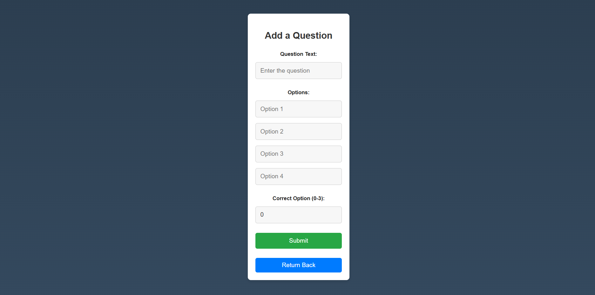

# Setup
For starting up the application, first install all node node modules required using command
```sh
npm install 
```
For Frontend start the reactjs server using command
```sh
npm start or  npm run dev
```
For Backend start the express server using command
```sh
node app.js
```
now frontend and backend both has been started you access the service on any browser at url http://localhost:8000


# Here are the Video For your Reference
[Watch the Video Tutorial](https://drive.google.com/file/d/1iJjIm0dN7vcylWzWbIpLMQI8XDcu6BDY/view?usp=sharing)


# Here are Screen preview 

### Signup Screen


### Login Screen


### Quiz Options Screen


### Create Quiz Screen


### Add Questions Screen


### Get Quiz Questions Screen

 
### Attempt Quiz Screen


### Final Submit Screen


### Final Result Screen


